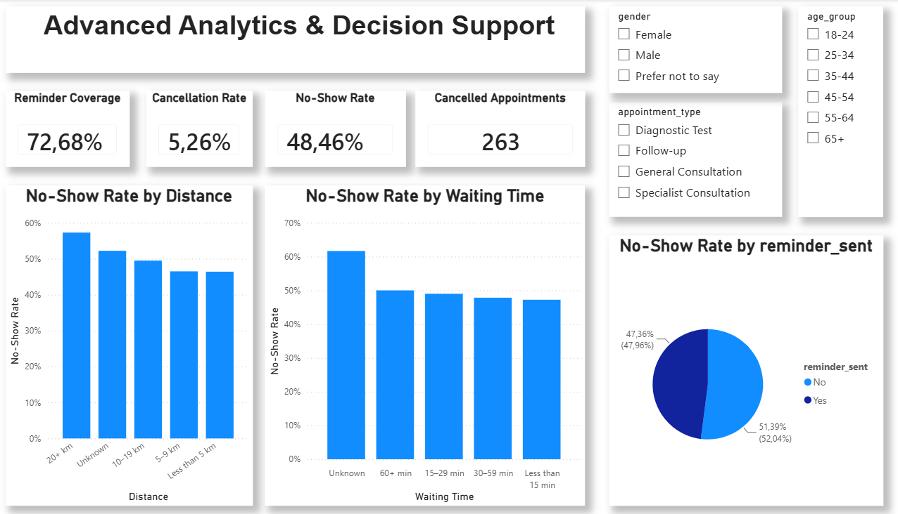

# AnalystLab_Africa_Week6
# HealthConnect – Week 6: Advanced Analytics & Decision Support

## Project Overview

HealthConnect is a multidisciplinary healthcare analytics project focused on improving patient appointment attendance and healthcare support using data and AI.

Week 6 builds on the Week 5 appointment attendance analysis by moving from initial exploratory analysis toward advanced analysis, KPI validation, decision support and preparation for future predictive modelling.

## Week 6 Objective

The objective of Week 6 was to:

- Build on the Week 5 Power BI analysis
- Validate important KPIs
- Investigate factors associated with appointment no-shows
- Identify important patient and appointment segments
- Improve the existing dashboard
- Develop evidence-based business recommendations
- Identify analytical inputs that could support future Data Science modelling
- Prepare analytical testing requirements for Week 7

## Dataset

The analysis uses the HealthConnect appointment dataset containing 5,000 appointment records and variables including:

- Patient information
- Appointment type
- Appointment date and time
- Booking lead time
- Previous appointments
- Previous no-shows
- Reminder status
- Reminder channel
- Distance to clinic
- Waiting time
- Appointment outcome

## Week 6 Dashboard

The Power BI dashboard was enhanced with:

- Reminder Coverage KPI
- Cancellation Rate KPI
- No-Show Rate KPI
- Cancelled Appointments KPI
- Gender slicer
- Age Group slicer
- Appointment Type slicer
- Reminder Status slicer
- No-Show Rate by Distance Band
- No-Show Rate by Waiting Time Band
- No-Show Rate by Reminder Status

## Key Findings

### No-Show Rate

The overall no-show rate remained high at:

**48.46%**

This confirms that appointment non-attendance remains the primary operational concern.

### Distance

The 20+ km distance group showed the highest observed no-show rate at approximately 57%.

This suggests that travel distance may be associated with appointment non-attendance and should be investigated as a potential accessibility factor.

### Waiting Time

The Unknown waiting-time group showed an approximately 62% no-show rate.

This result should be interpreted cautiously because Unknown represents missing information rather than an actual waiting-time category.

### Reminder Status

Appointments without a recorded reminder showed an approximately 51.39% no-show rate, compared with approximately 47.36% for appointments with a reminder.

This indicates an association between reminder status and attendance and supports further investigation of reminder strategies.

### Reminder Coverage

A new Week 6 KPI, **Reminder Coverage**, was introduced.

Reminder Coverage was approximately:

**72.68%**

This measures the proportion of appointments for which a reminder was recorded.

## Business Recommendations

1. Increase and evaluate appointment reminder coverage.
2. Consider targeted interventions for patients with previous no-shows.
3. Investigate accessibility barriers affecting patients travelling longer distances.
4. Improve waiting-time data collection and completeness.
5. Use the identified variables as candidate features for future no-show prediction modelling.

## Data Limitations

Important limitations include:

- Missing distance information
- Missing waiting-time information
- Missing reminder-channel information
- Observational analysis does not establish causation
- Cross-track Data Science validation was not completed during the Week 6 submission period

## Data Science Integration

The Analytics track identified potential modelling variables including:

- Previous no-shows
- Previous appointments
- Reminder status
- Reminder channel
- Distance to clinic
- Waiting time
- Appointment type
- Age group
- Booking lead time

These variables are proposed as candidate features rather than confirmed predictors.

## Week 7 Testing Focus

The proposed Week 7 testing will include:

- KPI reconciliation
- Dashboard and slicer testing
- Segment validation
- Missing-data sensitivity analysis
- Reminder analysis validation
- Recommendation validation
- Further relationship testing
- Cross-track validation where Data Science resources are available
- End-to-end analytical validation

## Tools

- Power BI
- DAX
- Excel/CSV data
- GitHub

## Project Progression

**Week 5:** Initial Analysis & Dashboard  
↓  
**Week 6:** Advanced Analysis → KPI Validation → Decision Support  
↓  
**Week 7:** Testing → Refinement → End-to-End Validation

